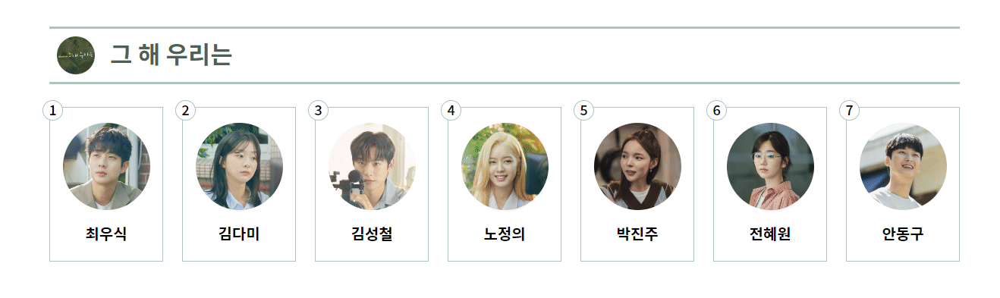
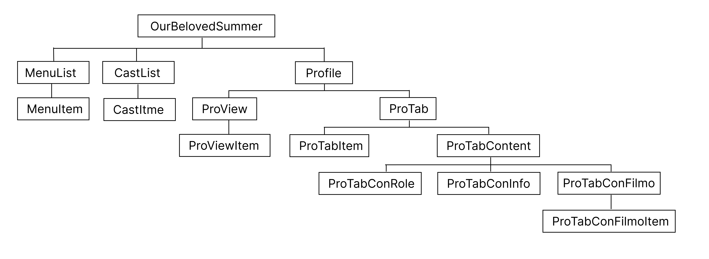

# 드라마 [ 그 해 우리는 ] 등장인물 프로필

# 1. Step1
- React JS
- 결과물
  
    
    이미지에 hover했을때 색상 변경
---
# 2. Step2
## 2.1 파일구조
- vite로 작성 및 기능 추가
- components 활용
  
    
## 2.2 화면
- 결과물 video
  
    
---
## 2.3 code 설명
- 상단 메뉴 '모든 인물, 주요인물, 그외의 인물'클릭시 데이터 변경
    <br>메뉴 클릭시 변경된 데이터의 첫번째 데이터를 화면에 출력
    ```js
    const onMenu = (category) => {
        setMenu(menu.map(item => item.category === category ? { ...item, isClass: true } : { ...item, isClass: false }))
        setProfileMenus(profileMenus)
        setNum(1)
        if (category === 'all') {
            setData(CastData.map((item, idx) => idx === 0 ? { ...item, isShow: true } : { ...item, isShow: false }))
            setShow(CastData.find((item, idx) => idx === 0))
            setPic(CastData.find((item, idx) => idx === 0).pictur[0])
            setIsSelectedId(1)
        } else {
            const castDataFilter = CastData.filter(item => item.category === category)
            setData(castDataFilter.map((item, idx) => idx === 0 ? { ...item, isShow: true } : { ...item, isShow: false }))
            setShow(castDataFilter.find((item, idx) => idx === 0))
            setPic(castDataFilter.find((item, idx) => idx === 0).pictur[0])
            setIsSelectedId(castDataFilter.find((item, idx) => idx === 0).id)
        }
    }
    ```
- 상단 이미지 클릭시 프로필 정보 출력
    ```js
    const onShow = (id) => {
        setData(data.map(item => item.id === id ? { ...item, isShow: true } : { ...item, isShow: false }))
        setShow(data.find(item => item.id === id))
        setPic(data.find((item) => item.id === id).pictur[0])
        setProfileMenus(profileMenu.map((item, idx) => idx === 0 ? { ...item, isProfile: true } : { ...item, isProfile: false }))
        setIsSelectedId(id)
        setNum(1)
    }
    ```
- 작품활동에서 예고편보기 토글
    ```js
    const onTrailer = (id) => {
        if(isSelectedId.find(item=>item === id)){
            setIsSelectedId(isSelectedId.filter(item=>item !== id))
        }else{
            setIsSelectedId([...isSelectedId, id])
        }
    }
    ```
- 작은 이미지 클릭시 큰이미지 박스에 출력
    ```js
    const onView = (id) => {
        setPic(show.pictur.find(item => item.id === id))
    }
    ```
---
### # 참고사이트
- 그 해 우리는 : SBS / 2023.06.08 / https://programs.sbs.co.kr/drama/ourbelovedsummer/main
- 그 해 우리는 - 나무위키 / 2023.06.08 / https://namu.wiki/w/%EA%B7%B8%20%ED%95%B4%20%EC%9A%B0%EB%A6%AC%EB%8A%94